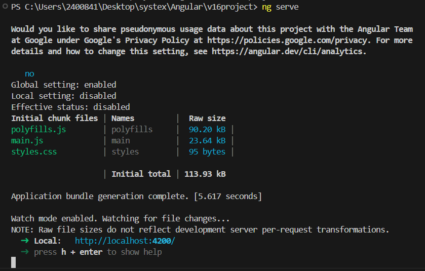

= 框架簡介

Angular官方在版本14時推出了獨立元件 （Standalone Components），是一種可以獨立於 Angular 模組系統運行的元件。這意味著它不需要在某個 NgModule 中註冊，而是可以自己包含所需的依賴，通過直接導入其他元件、指令或管道來進行組織。

而從 Angular 17 開始，官方建議開發者優先使用獨立元件（Standalone Components）而非傳統的 @NgModule，在默認新建的專案中將看不到以往app.module.ts檔案。

然而，@NgModule 並未被完全移除。在某些情況下，如需要組織大型應用程式或使用特定功能時，仍可能需要使用 @NgModule。現有的許多專案也是以傳統的 @NgModule進行管理與組織，因此對於初學者而言，我們有必要先瞭解@NgModule。

因此，我們在使用新版本的Angular創建專案是會多加**--no-standalone**參數，用以創建類似舊版本的默認結構。

[source,cmd]
----
ng new v16project --no-standalone
----

* Which stylesheet format would you like to use? 

----本課程選 CSS

* Do you want to enable Server-Side Rendering (SSR) and Static Site Generation (SSG/Prerendering)? 

----Server-Side Rendering (SSR) 和 Static Site Generation (SSG) 是現代 Web 開發中的兩種常見技術，它們可以顯著提升網站性能和 SEO 表現。本課程選no

執行ng new時，安裝需要一段時間，安裝完成後可以在資料夾中看到新增的專案。

== Angular專案結構

打開所建的專案，可以看到如下的結構：

== Angular基本概念

實作前，我們先對Angular的架構有初步的認識，以便在之後的開發中更有概念。

=== 元件（Component）

元件定義了畫面，是一組 Angular 可以根據屬性（propertie）、方法（method）和資料內容去操作的畫面中的元素。或也可說是畫面範圍的區塊，小從一個按鈕元件、大到整個畫面都能劃分到一個元件之中。 根據在元件類（export class）之中定義的邏輯、屬性和 API 來支援顯示端 View 的作動，在使用上可以根據複用性 reuseable 作考量，當我們發現一個按鈕、表單或者功能可以抽象提取出來提供其他地方使用，即是劃分元件的時機。 在應用程式中切換穿行時，Angular 就會建立、更新、銷毀一些元件，我們的應用程式可以透過 Lifecycle hooks 選擇在這些操作生命週期裡面特定的時機觸發動作。

==== Template（模板）

模板是元件用來顯示視覺效果和用戶交互的核心部分，負責描述元件的UI和HTML結構。其内部也可以從一個獨立的 .html 文件中引入。在模板中可以使用Angular提供的模板語法（如插值 {{}}、指令 ngIf 和 ngFor 等）來實現數據綁定和邏輯控制。

Component 和 Template 的關係

元件的模板用於定義其視圖部分，通常是HTML加上Angular的標記（如指令、管道等）。
元件和模板之間的關係通過以下兩種方式進行綁定：

* Property Binding（屬性綁定）：將元件的屬性值綁定到模板中的HTML屬性上，以更新視圖的狀態。

* Event Binding（事件綁定）：將模板中的用戶交互事件（如按鈕點擊）綁定到元件中的方法，以響應用戶的操作。

==== Class（類）

元件的類是用 TypeScript 寫成，包含了模板中使用的邏輯和數據。

* Properties（屬性）：元件中的屬性通常保存用於顯示的數據，這些數據可以被模板中引用和展示。

* Methods（方法）：元件中的方法負責處理業務邏輯，通常與模板中的事件（如按鈕點擊）綁定，執行具體的操作。
這部分類的主要作用是將數據和行為組合在一起，並通過屬性綁定和事件綁定來實現與模板之間的交互。

==== Metadata（元數據）

元數據是使用 @Component 裝飾器定義的，這些元數據為Angular提供了元件的相關信息，讓Angular知道如何處理這個類。

* selector：定義元件的標識符，用於將該元件插入HTML中。

* templateUrl 或 template：指向元件的模板。

* styleUrls 或 styles：指定元件的樣式。

元數據描述了元件的結構以及如何將模板、樣式和邏輯聯繫起來，使得Angular框架能夠正確地初始化和渲染元件。

=== 模組（Module）

Angular 的 Module 是透過 @NgModule 這個裝飾器 decorator 宣告的類別，NgModule 是 Angular 應用程式最基本的組成元素，有點像是類別(class)，把相互關聯的其他元件(Components)、服務(Services)封裝、打包起來，成為一內聚的功能塊，指定宣告哪些編譯過的內容提供給外部使用。 每個 Angular app 最少都有一個根模組 root module 用來啟動此應用程式，按照慣例命名為 AppModule，除此之外通常還會包含有其他不同功能的模組。

==== Declares（聲明）

模塊的 declarations 屬性用於聲明該模塊內的元件、指令和管道。
這意味著這些元素是模塊內部的一部分，只能在模塊內被其他元件使用，除非通過 exports 明確地將它們導出。
元件（Components）：元件是Angular應用中的視圖部分，每個元件都必須被某個模塊聲明。
指令（Directives） 和 管道（Pipes） 也必須由模塊聲明，以便在模塊內部使用它們。

==== Provides（提供）

模塊可以使用 providers 屬性來註冊服務。這些服務可以用於提供業務邏輯、數據處理、HTTP請求等。
服務（Services） 通常是應用中用於共享功能的單例物件，通過依賴注入的方式提供給需要的元件。
服務的提供可以是全局的（應用級別）或者局部的（模塊或元件級別），這取決於服務的註冊位置。
==== Imports（導入）

模塊的 imports 屬性用於導入其他模塊的資源。
通過導入其他模塊，一個模塊可以重用這些模塊中聲明的元件、指令、管道或導出的其他功能。
常見的導入模塊包括 CommonModule（用於提供常見的Angular指令，如 ngIf 和 ngFor），以及 FormsModule（用於處理表單）。

==== Exports（導出）

模塊的 exports 屬性用於將聲明在當前模塊中的元件、指令或管道導出，使它們可以被其他模塊使用。
通過導出特定資源，其他模塊在進行導入時可以使用這些資源，這有助於功能的重用和應用模塊化設計。

=== 注入器（Injector）

Injector 是Angular 依賴注入機制，它負責創建服務（Service）的實例並將其注入到應用中需要這些服務的原件、指令或其他服務中。
依賴注入系統允許Angular在應用的不同部分之間共享相同的服務實例，這樣可以減少重複創建對象的開銷，並保持全局狀態的一致性。

[[Directive]]

=== 指令（Directive） 

在Angular中，Directive（指令）是一個非常強大的工具，它使得開發者可以直接操作DOM元素，擴展HTML的功能和行為。Angular中的指令有不同的類型，每一種都有不同的作用，用於實現特定的UI交互和控制。

== Angular架構的概覽

=== 1 Bootstrapping

Bootstrapping 是Angular應用啟動的第一步。
Angular應用程序從 main.ts 文件中啟動，它會引導（bootstrap）根模塊（通常是 AppModule）來啟動應用。
根模塊負責初始化應用和加載所有必需的模塊、元件和服務。

=== 2 NgModule 的 Imports

Imports 是指從其他模塊導入所需的功能。
當我們需要某些來自其他模塊的功能時，可以使用 imports 將它們導入到當前模塊中。
通過導入其他模塊，能夠有效地重用功能並且保持應用的模塊化結構，例如 CommonModule 或 FormsModule 等。

=== 3 NgModule 的 Exports

Exports 用於將當前模塊中的功能導出，以便其他模塊可以使用它們。
如果某個元件、指令或管道需要在其他模塊中被使用，就需要通過 exports 將其導出。
這有助於在模塊之間共享特定的功能或視圖元件。

=== 4 NgModule 的 Declarations

Declarations 用於宣告模塊中擁有的元件、指令和管道。
只有被宣告的元件、指令和管道才能在該模塊內部使用。
通常，每個元件、指令或管道只能在一個模塊中宣告。

=== 5 Providers

Providers 用於註冊服務（Service），這些服務在應用中提供共享的邏輯或數據。
Providers 提供服務的藍圖，Injector 使用這些藍圖來創建服務的實例。
註冊的服務可以是應用級別（全局）或模塊級別的，具體取決於服務的提供方式。

=== 6 Injector

Injector 負責管理和創建服務的實例。
當元件需要一個服務時，Injector 會根據 Providers 提供的藍圖創建相應的服務實例並注入到元件中。
這樣的依賴注入機制使得應用中的依賴項可以被多個元件共享，同時保持代碼的鬆耦合和高重用性。

== 運行專案

在有了基本的概念後，我們可以透過**ng serve**指令來運行專案

[source,cmd]
----
ng serve
----

此時在瀏覽器中輸入 **http://localhost:4200/**就能看到Angular新專案的預設頁面，我們也可以順便透過Angular DevTools來進行應用的調試和分析。

link:../version17+/01-框架簡介.adoc[version17+]