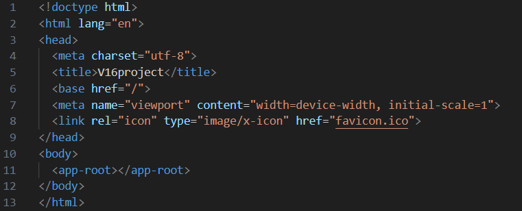

= 專案結構

== src

src 底下包含了 Angular 應用的所有程式碼，這是開發人員編寫應用邏輯、定義樣式、設計視圖等操作的主要工作區域，其中的內容將會被編譯和打包，生成可部署到生產環境的應用程式。

=== main.ts

main.ts 是應用程式的第一個執行文件，它將 Angular 的模塊和元件與瀏覽器環境掛鉤，從而使應用能在瀏覽器中運行。

* 創建平台：通過 platformBrowserDynamic() 創建一個適用於瀏覽器的運行平台。

* 啟動應用：使用 bootstrapModule(AppModule) 將應用的根模塊 AppModule 加載到平台中，從而啟動 Angular 應用。

* 事件合併：啟動應用時設置 ngZoneEventCoalescing: true，以便更高效地處理頻繁觸發的事件。

=== index.html

* 加載 index.html：瀏覽器加載 index.html，並識別到 <app-root> 標籤。這個標籤是占位符，Angular 應用的所有內容最終會渲染到這裡。

* 啟動應用：main.ts 文件中，platformBrowserDynamic().bootstrapModule(AppModule) 會啟動應用，並加載應用的根模塊 AppModule。

* 渲染根元件：根模塊 AppModule 中指定了根元件（AppComponent），這個元件負責渲染初始的應用視圖，並替換 <app-root> 的占位符內容。

* 應用渲染：根元件的模板被渲染後，應用的其他部分（其他元件）也會通過路由或屬性綁定等方式渲染到頁面上。

=== style.css

styles.css 是應用程式的全局樣式文件。
這個文件中的 CSS 樣式會應用於整個 Angular 應用的所有元件。可以在這裡定義一些通用的樣式，例如頁面的佈局、通用的顏色配置或全局的 CSS 重置樣式。

=== app

app是應用的核心資料夾，通常包含應用的主要模塊、元件、服務等。Angular 的大部分邏輯和功能都實現在這裡。

==== app.module.ts

* @NgModule 裝飾器 用於配置模塊，聲明元件、導入其他模塊、提供服務，並指定應用的引導元件。

- declarations 聲明了元件，只有聲明的元件才能在這個模塊中使用。

- imports 引入外部模塊，增強模塊的功能。

- providers 用於註冊服務，支持依賴注入。

- bootstrap 指定應用的根元件，應用啟動時會首先渲染這個元件。

==== app.component.ts

定義了 Angular 中的根元件 (AppComponent)

image:../images/app.components.ts.png[]

* @Component 裝飾器 用於定義 AppComponent 類為 Angular 的元件。

* selector 用於指定元件的標籤名，可以在 HTML 中用 <app-root> 來引用這個元件。

* templateUrl 用於指定元件的 HTML 模板，用來渲染元件的視圖。

* styleUrls 用於指定元件的 CSS 樣式文件，用來定義元件的外觀。

* AppComponent 類 包含元件的數據（例如 title）和應用的邏輯。

==== app.component.html

app.component.html 是根元件 AppComponent 的模板文件。這個文件負責定義元件的視圖，包含了應用的基本 HTML 結構和顯示邏輯。它與元件的 TypeScript 文件 (app.component.ts) 相互配合，將應用的數據和視圖綁定在一起。

* {{ title }} 是 Angular 中的插值表達式，用來在模板中顯示元件的屬性值。

* 在這段程式碼中，title 是從 AppComponent 類別中引入的屬性，其值被動態綁定到模板中。

* 當應用啟動時，Angular 會自動將 title 的值插入到該位置，實現數據的顯示更新。

==== app.component.css

app.component.css 是 Angular 根元件 (AppComponent) 的樣式文件，用於定義該元件的樣式和外觀。在 Angular 中，每個元件都可以有一個與之相關的樣式文件，用於控制這個元件的外觀。這樣的設計提供了樣式隔離的功能，使得每個元件的樣式不會影響到其他元件的樣式，這就是 元件級別的樣式封裝。

==== app-routing-moudle.ts

app-routing.module.ts 是 Angular 中負責應用路由配置的文件，通常稱為 "路由模塊"。這個文件的作用是定義應用程式中各種路由（即 URL 與元件之間的映射關係），使得應用能夠在不同的路由中導航，從而構建單頁應用（SPA）。

* Routes 配置：routes 用於定義應用中的所有路由，目前是空的，可以根據需要擴展。

* RouterModule.forRoot(routes)：用於配置根模塊的路由，並在應用啟動時加載路由配置。

* exports: [RouterModule]：將 RouterModule 導出，讓其他模塊可以使用路由功能。

==== app.component.spec.ts
app.component.spec.ts 是 Angular 元件的單元測試文件，它通過 Jasmine 和 Angular 的 TestBed 工具來編寫和運行測試。

* describe 語句：描述測試套件，組織一組相關的測試案例。

* beforeEach 語句：在每次測試之前配置測試環境，確保每個測試案例有一個獨立的測試上下文。

* it 語句：定義具體的測試案例，檢查元件的創建、屬性值和模板渲染等行為。

