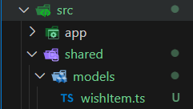
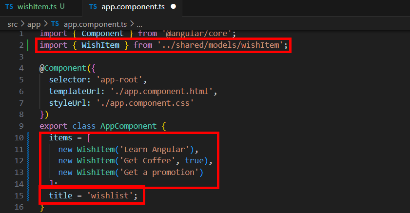
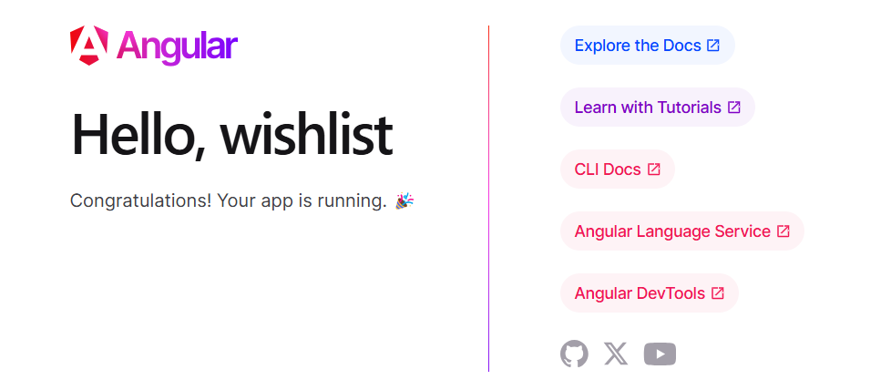

= Creating a Data Model

以楷書我們要建立一個願望清單，由於該清單的内容是要在整個應用程式中都要使用的數據，所以我們可以在src資料夾底下建立一個名爲shared的資料夾，再在shared底下建立一個名爲models的資料夾。

在models底下建立我們需要的願望清單，因爲該清單會需要導出至其他檔案中的某個位置，所以我們以 TypeScript 的格式建立該檔案，我們將他命名為wishItem.ts。

每當我們在其他檔案中創建WishItem這個類別時，需要到處它，在 wishItem.ts 中我們將類別命名為 WishItem ，同時利用 TypeScript 的特性，定義一個建構子，使其自動為該類別創建屬性，在這裏我們創建 wishText 和 isComplete 這兩個屬性，並將這兩個屬性設為 public ，讓這些資訊公開， TypeScript 之所以叫 TypeScript 是因爲他允許我們指定正在處理的資料的型別，這裏我們將 wishText 設定為 string，用於表示願望的名稱，將 isComplete 設定為 boolean，表示是否已經實現，同時默認值為 false。

[source,TypeScript]
----
export class WishItem {
    constructor(public wishText : string, public isComplete : boolean = false){
        
    }
}
----

接著我們回到 app.component.ts ，將 WishItem這個列別導入，在 AppComponent中，我們建立一個名爲 item 的陣列用於記錄願望，並在陣列中調用 WishItem 的建構子創建每個願望。

順便把 title 改爲 'wishlist'

此時我們打開瀏覽器應該會看到如下的畫面：

