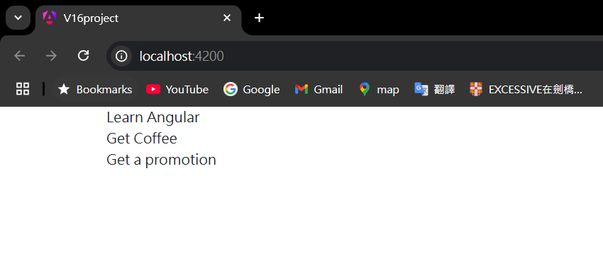

= Iterating Arrays

我們在 AppComponent 中創建了包含多個 WishItem 物件的 items 陣列，接下來我們將顯示該陣列中的内容

首先將默認的 template 刪除，打開 app.component.html 並刪除其中的所有内容，接著在 index.html 中引入 Bootstrap 的樣式，如此一來應用程式中的所有内容都可以使用 Bootstrap

[source,html]
----
<link href="https://cdn.jsdelivr.net/npm/bootstrap@5.3.3/dist/css/bootstrap.min.css" rel="stylesheet" integrity="sha384-QWTKZyjpPEjISv5WaRU9OFeRpok6YctnYmDr5pNlyT2bRjXh0JMhjY6hW+ALEwIH" crossorigin="anonymous">
----

在 app.component.html 中，我們可以試著用一個簡單的
標籤配合{{}}的語法將第一個願望顯示出來

打開瀏覽器應該可以開到第一個願望已經顯示出來了

如何將陣列中的所有元素都顯示出來呢？有一點程式語言基礎的我們通常第一個想到的是 for迴圈 ，不過 Angular 爲我們提供了一種簡單的方法實現該需求，該方法我們稱爲指令（directive），指令是以"*ng"的形式開頭，使用起來會像是在操作標籤的屬性

很顯然我們這邊需要的會是 "ngFor" 這個指令，其本質上為 JavaScript 的運算式，寫法為"let...of..."，像這個會改變 DOM 結構的指令我們成爲結構指令(structural directive)
link:01-框架簡介.adoc#Directive[Directive]

透過以上寫法，我們就可以將陣列中的所有元素都顯示出來了

在瞭解如何使用該指令後，我們就可以在此基礎上去進一步實現更複雜的需求了，這邊我們以 checkbox 的形式顯示每個願望

[source,html]
----

  <ul class="wish-list">
    <li *ngFor="let item of items">
      

        <label class="form-check-label">
          <input type="checkbox" class="checkbox"> {{item.wishText}}
        </label>
      

    </li>
  </ul>

----

[source,css]
----
.wish-list{
    list-style: none;
}
----

完成後應該顯示如下

