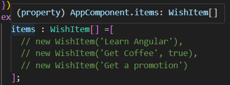

= Making Decision

現在我們已經透過 *ngFor 指令將陣列中的元素都展示出來了，但是在實際的開發中，這些數據往往是從後端動態載入的，所以我們不得不思考一個很常見的問題，如果沒有數據要怎麽顯示？

當我們把 items[] 中的内容注釋起來並保存，會發現無法正常運行

image:../images/without-data.png[]

在終端中顯示 "Error occurs in the template of component AppComponent."，表示 AppComponent 這個模板有 Error ，我們點開 app.component.html 查看

顯示 "Property 'wishText' does not exist on type 'never'",打開瀏覽器會發現有一樣的 Error 提示

那麽問題來了， "never" 是什麽？

其實這與 TypeScript 的機制有關，當我們在創建 item[] 時，TypeScript會根據陣列的内容假設該陣列的Type

如果陣列爲空，那麽TypeScript會假設該陣列的Type為 "never" ,此時對TypeScript 而言，這個陣列將永遠為空

我們有兩個方式可以解決這種問題，第一種是可以將該陣列宣告為 any 型別，使用這種方法將被視爲 JavaScript 的方法

另外一個方法將是本專案使用的方法，因爲我們知道 items 只會是一個包含 WishItem 物件的陣列，所以可以直接宣告其 Type 為 WishItem[]，如此一來程式也可以正常運行了

通常我們不會在沒有内容情況下就不顯示任何畫面，有些場景可能還是會希望顯示相關的默認畫面，就比如現在這個專案在沒有任何願望時，如果要顯示 "There are no wishes to display."的字樣，應該怎麽做呢？

此時我們可以使用 Angular 提供的 "*ngIf" 結構指令來實現，在標簽中添加該指令，會根據其後方的判斷式來決定是否展示該標簽，如果判斷式的結果為 true ，則顯示該標簽，結果為 false 則不顯示，因此我們可以透過如下的寫法來實現

打開瀏覽器，可以看到如預期的一樣，當沒有數據時，畫面會顯示"There are no wishes to display."的字樣

一切看似很美好，但當我們打開瀏覽器的開發者工具查看時，會發現 ul 標簽也被渲染了

image:../images/problem-ngIf.png[]

在沒有元素需要被展示時，我們不希望相關的標簽被渲染，不幸的是，Angular 並沒有提供 "*ngElse" 這種結構指令，因此我們在解決相關問題的方法之一是再使用一個"*ngIf" 指令

不過以上的寫法其實閲讀起來不夠清晰，這邊介紹一種更有邏輯的寫法，我們會用到<ng-template> 用來定義一段模板，<ng-template> 是 Angular 中用於定義嵌入視圖的模板。這些模板本身不會直接渲染在 DOM 中，而是根據需要在特定條件下動態地顯示。這個標籤非常靈活，可以用於懶加載、動態內容插入，以及條件渲染等場景

如此一來，我們的程式碼看起來會更加清晰也更有邏輯，打開開發者工具也可以看到不需要被展示的内容也不會被渲染了

在此基礎之上，我們可以再對我們的程式碼進行如下的精簡

[source,html]
----

  

    There are no wishes to display.
  

  <ng-template #showItems>
    <ul class="wish-list">
      <li *ngFor="let item of items">
        

          <label class="form-check-label">
            <input type="checkbox" class="checkbox"> {{item.wishText}}
          </label>
        

      </li>
    </ul>
  </ng-template>

----

現在我們已經學會兩種結構指令了，但需要注意的是，同一個標簽不能同時使用兩個結構指令

