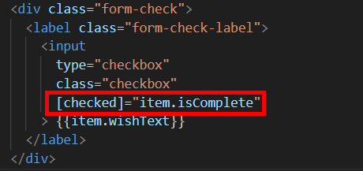
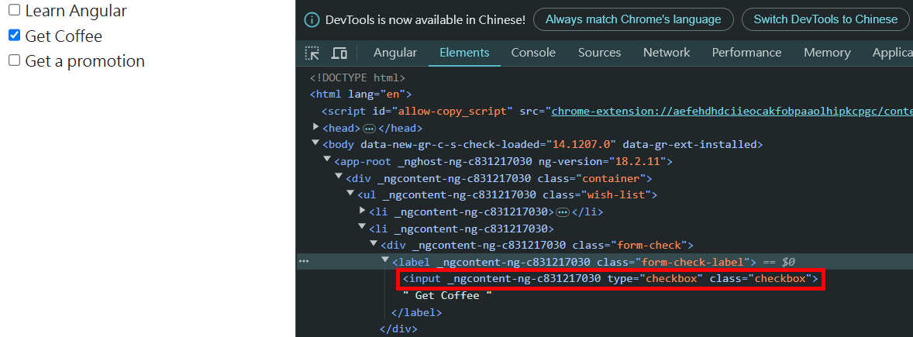
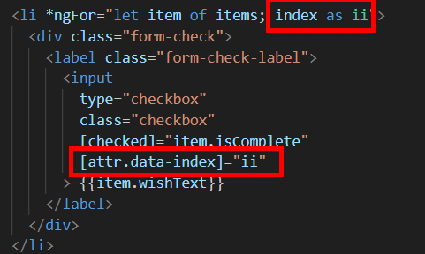
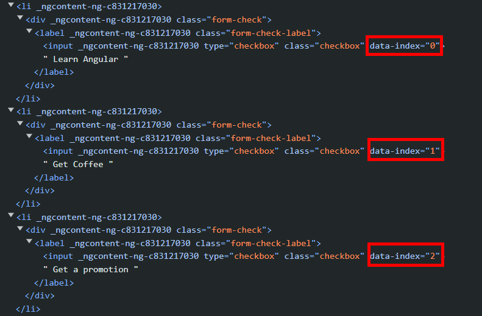

= Binding Data to Properties and Attributes

其實我們寫程式就是在處理各種數據，這些數據可以以任何形式展現，我們會更具應用程式的需求去決定如何對數據進行處理以及展示，以目前的願望清單來説，我們有兩條想要展示的資訊，一個是目前已經實現的願望文本，還有一個是是否已經實現，之所以將願望的文本設計成復選框，是因爲我們想要根據是否勾選來表示願望的實現與否

我們都知道，以HTML來看，關於復選框只需要將 "checked" 屬性（Attribute）添加到元素中，無論其值為何，都會使其顯示為勾選狀態

在 JavaScript 方面，此 input 元素具有 "checked" 的 boolean 屬性（Property），true 則勾選，false 不勾選，所以 JavaScript 屬性和 HTML 的屬性名稱相同，但行爲不同

因爲我們的數據是布林值，很直覺地要綁定 isComplete 到 input 元素上選中的 JavaScript 屬性，這裏我們可以使用 Property Binding 實現，我們將用一對中括號[]獲取 JavaScript 的屬性名稱，並用運算式決定是否勾選

打開開發者工具會發現，此 input 元素沒有 checked 屬性，正式因爲我們使用的是 JavaScript 的屬性，而不是HTML屬性

結論就是，當我們想要把某寫内容綁定到 JavaScript 屬性時，只需要用中括號把屬性名包起來並分配一個 JavaScript 表達式，如此一來該表達式將被綁定到該屬性上

在綁定屬性時，要注意不要把HTML屬性和JavaScript屬性搞混，例如想要讓td元素綁定到 "colspan",要使用 "colSpan" 而不是 "colspan"

其實我們也可以綁定到 HTML 屬性，使用的方法是在屬性名前面添加一個 "attr." 前綴，例如我們如果想要在每個 li 元素上添加 "data-index" 這個 HTML 屬性，就可以寫成 "attr.data-index" 

打開開發者工具也可以在該 HTML 標簽上找到該屬性

圖中的 index 是 *ngFor 提供的內置變數之一，透過它可以在迭代時獲取每個索引值，便於操作和管理，*ngfor 還提供了 first、last、odd、even 這些變數方便開發者使用

