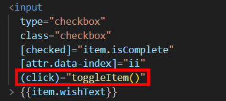
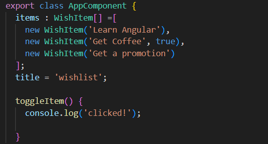
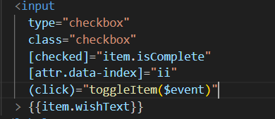
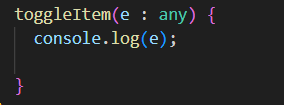
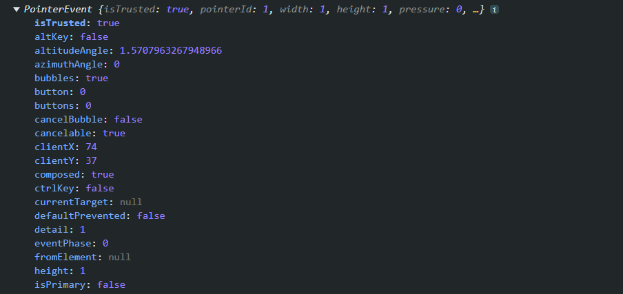
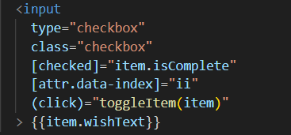
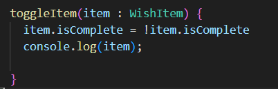
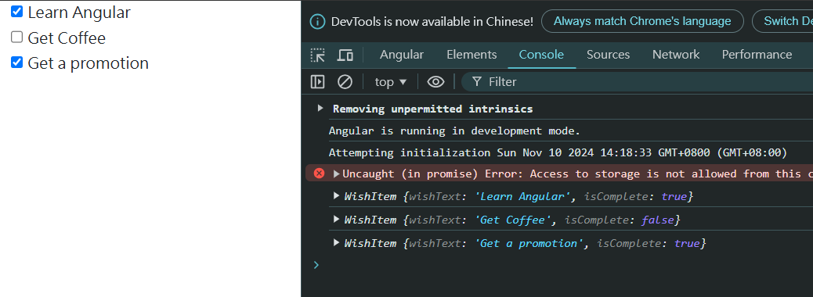

= Bingding Event

很顯然在這個復選框的功能上只使用 Property Binding 是無法實現 isComplete 隨著複選框的勾選產生相應的變化

爲了綁定一個事件，在 Angular、React 和 Vue等 UI 庫的世界中，是以聲明的方式完成此操作，在 Angulat 中的事件綁定和屬性綁定的方法很類似，不同之處在於我們使用小括號而不是中括號，當事件觸發時就會執行寫在後方的 JavaScript 表達式或函式

在 app.component.ts 中增加該函式

當涉及到 DOM 事件時，我們通常要做的一件事就是訪問事件物件，因爲該物件爲我們提供了有關事件的大量資訊，使用 "$event" 就可以將 event 物件傳遞給所寫的函式

相對應的函式：

可以看到該物件有許多資訊可供開發人員使用

不過以我們目前專案的需求來看，我們只是想改變 item 的 isComplete ，因此我們只需要將 item 傳遞給所寫的 toggleItem ，如此一來我們便可以在函式中操縱該物件

對應的邏輯如下：

如此一來就可以通過事件綁定實現需求了

