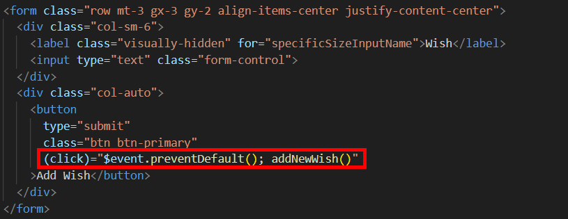
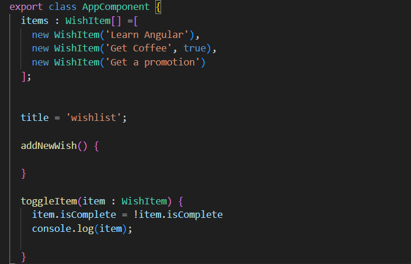
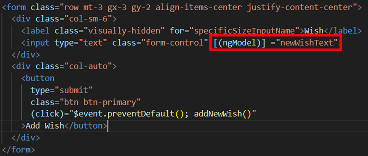
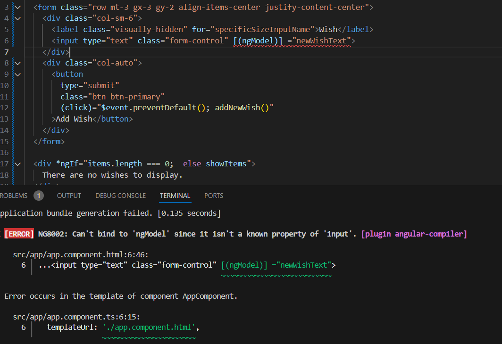
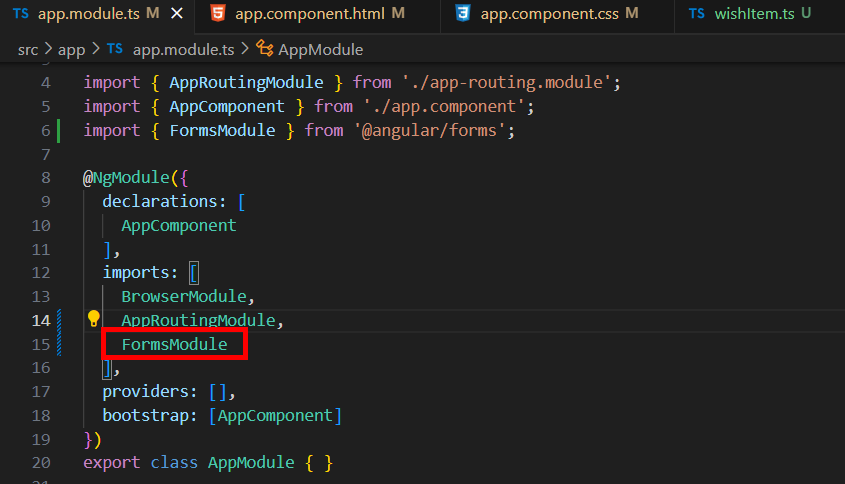
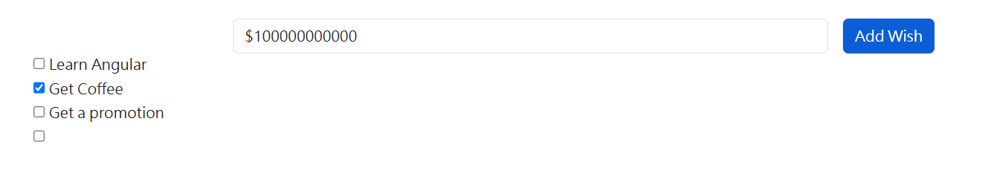
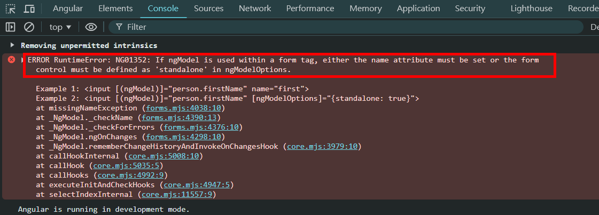
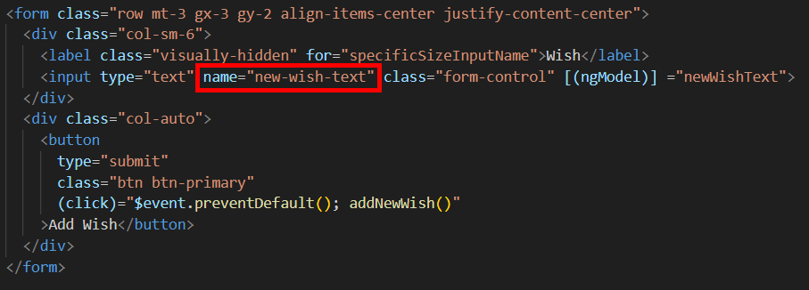

= Using ngModule to Bind Values to Form Controls

事件允許使用者與應用程式進行交互，表單則允許使用者向應用程式提供數據，Angular 提供了兩種不同的方式處理表單，一種成爲回應式表單（reactive forms），另一種種是模板驅動表單（template-driven forms）

這裏我們使用模板驅動的方法，首先在頁面中添加一個表單用於添加願望：

[source,html]
----
  <form class="row mt-3 gx-3 gy-2 align-items-center justify-content-center">
    

      <label class="visually-hidden" for="specificSizeInputName">Wish</label>
      <input type="text" class="form-control">
    

    

      <button type="submit" class="btn btn-primary">Add Wish</button>
    

  </form>
----

我們綁定一個 click 時間，該事件要做的第一件事就是阻止表單被提交，因爲表單的提交是表單内按鈕的預設行爲，透過 "$event.preventDefault()"，就可以實現，接著我們可以調用一個名爲 "addNewWish" 的方法用於新增願望

當然我們也要將該方法添加到我們的 component 類別中

現在我們需要做的是找到一種方法將數據綁定到表單中的 input 元素，我們可以使用一個看起來似曾相識的語法來做到這一點，我們可以通過中括號包小括號的方式同時實現屬性綁定和事件綁定，可以使用一個名爲 "ngModel" 的特殊指令，該指令用來實現表單控件與應用程式數據之間的雙向數據綁定。這使得使用者的輸入能夠自動更新元件的屬性，而屬性值變更也能即時反映到輸入控件上。

簡單來説就是用來告訴 Angular 這裏有一個 form 欄位想要綁定到我們類別上的一個屬性，我們在類別中新增一個 "newWishText" 屬性，用來與該 input 元素綁定

[source,typescript]
----
export class AppComponent {
  items : WishItem[] =[
    new WishItem('Learn Angular'),
    new WishItem('Get Coffee', true),
    new WishItem('Get a promotion')
  ];

  newWishText = ''

  title = 'wishlist';

  addNewWish() {
    this.items.push(new WishItem(this.newWishText));
    this.newWishText = '';
  }

  toggleItem(item : WishItem) {
    item.isComplete = !item.isComplete
    console.log(item);
    
  }
}
----

但是即便我們這樣做了，還是會有一個 Error

該 Error 顯示無法綁定 ngModel ，因爲他不是 input 的已知屬性，我們這邊要做的是在 app.modules.ts 中導入 "FormsModule" ，如此一來便可以在應用程式的任何地方使用 ngModel 指令了

接下來我們就可以去使用我們的新功能了，在添加完願望提交後，我們會看到如下的畫面：

打開開發者工具看到如下報錯：

該 Error 顯示如果在 form 標簽中使用 ngModel 必須設置 name 屬性或表單的控制必須在 ngModelUptions 中定義為 "standalone"，在 Angular 中，當在表單元素中使用 ngModel 時，Angular 期望該元素具有一個唯一的標識符（通過 name 屬性來提供）。這是因為 Angular 使用模板驅動表單管理表單控件的狀態，並將它們組織到一個父級的 FormGroup 中。

一種方式是通過 ngModelOptions 設置該控件為“獨立”（standalone）模式，這樣 Angular 就不會將它納入父級的 FormGroup 管理。這裏我們在 input 元素上添加一個 name 屬性來解決這個問題

如此一來該功能就可以實現了

