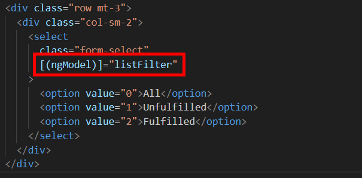
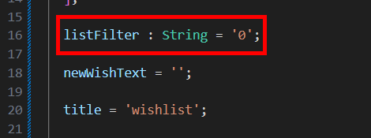
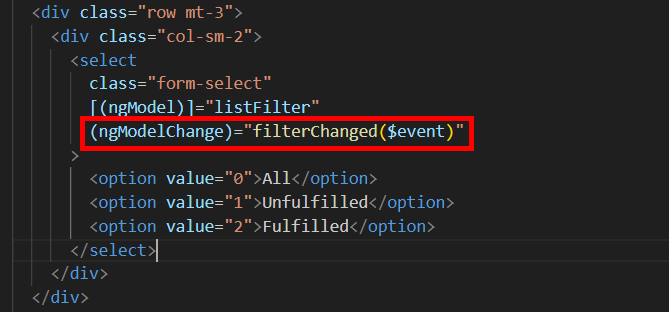
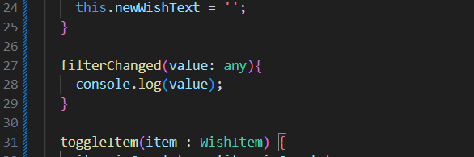
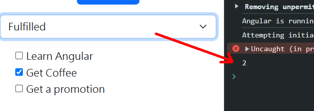
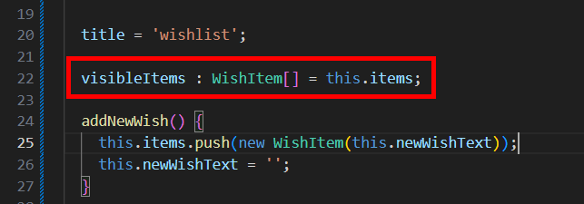
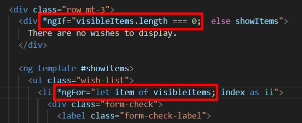

= Listening for Changes to ngModel Values

現在我們想對我們所列出來的願望清單進行篩選，以便使用者可以根據不同需求篩選清單，這邊選擇使用 select 元素來實現三種可能的選項，分別是 "All"、"Unfulfilled" 和 "fulfilled"，我們把他添加在表單下方：

[source,html]
----
  

    

      <select class="form-select">
        <option value="0">All</option>
        <option value="1">Unfulfilled</option>
        <option value="2">Fulfilled</option>
      </select>
    

  

----

接著我們使用 ngModel 指令將其綁定到原件上的屬性

並在原件中定義該屬性，將型別定義為 String 是因爲我們是綁定的是 option 標簽的 value 值，我們可以透過他設定默認值，這邊寫 "0"，也就是默認為 "All"

在完成以上設定後，現在需要設定 select 元素，我們使用一個名爲 "ngModelChange" 的特殊事件，改事件只在模型發生改變時才觸發，也因此該指令只能在使用 ngModel 指令的元素上使用

值得注意的是，此事件的 event 也不是典型的 event 物件，他包含了 model 的新值，因此當使用者選擇其他 option 時，該 option 的 value 值將傳遞給所選的任何方法，這邊我們定義的方法名為 "filterChanged"

當我們打更改 filter 的值是，可以在開發者工具中看到其對應的輸出：

我們不會去真的過濾 items 陣列，畢竟那是唯一的數據來源，所以我們可以在元件中另外添加一個 "visibleItems"屬性，其本質為 items 陣列的副本，他將用於記錄各種篩選的結果，因此使用 items 對其初始化

在 filterChanged() 中為 visibleItems 實現各種情況下的賦值

[source,typescript]
----
  filterChanged(value: any){
    if(value === '0') {
      this.visibleItems = this.items
    } else if (value === '1') {
      this.visibleItems = this.items.filter(item => !item.isComplete);
    } else {
      this.visibleItems = this.items.filter(item => item.isComplete);
    }
  }
----

接著在模板中使用新的visibleItems

現在看似已經完成了。但實際上任然有不少問題需要解決，比如當我們選擇 "unfulfilled" 後又新增一個願望，但是卻沒有馬上顯示出來，這是因爲加入到 item 陣列的數據並沒有立刻同步到 visibleItems 陣列中，在選擇過其他選項後再選擇 "unfulfilled" ，新增的願望才會展示出來，同樣的，當我們對複選框進行勾選時，也不會及時歸類到正確的篩選分類中

這些錯誤都可以很簡單地修正，我們只要在 items 陣列修改時及時更新 visibleItems 就可以了，不過其實有更好的方法可以使用，就是將 visableItems 陣列轉換為 getter ，如此一來就可以對原始 items 陣列所做的更改做出反應

