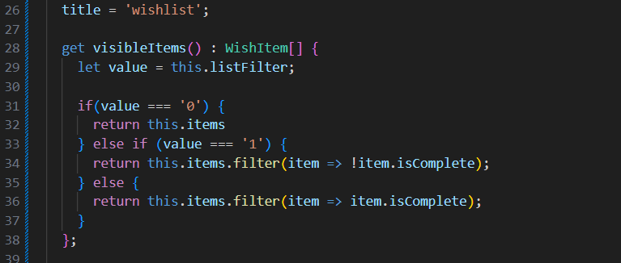
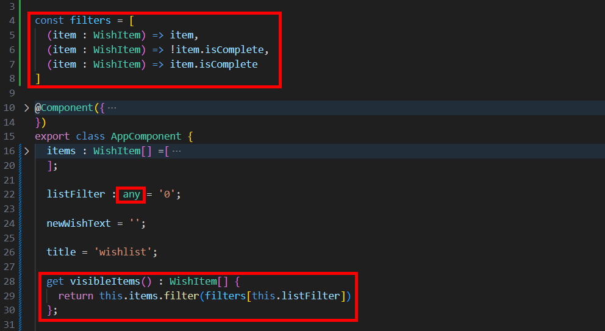

= Using Getters to Filter and Provide Data

這邊要使用一個來自 JavaScript 而不是來自 Angular 的功能 getter，他是一種用於訪問物件屬性的方法，讓我們可以定義一個物件屬性來獲取其值，而不是直接訪問該屬性的數據。getter 方法可以用來封裝一些邏輯，使得在讀取屬性值時可以進行額外的計算或控制。

我們可以將 visibleItems 重新調整為 getter ，讓他返回一個陣列，並且該陣列依賴於 filter，使其返回對應的值，我們將 filterChanged() 中的程式碼移到 getter，再做相對應的改寫如下：

這樣我們就把一切都建立在 items 陣列的基礎上，每當該陣列修改時，就會自動反應在瀏覽器中了

這同時也意味著在這裏我們將不再需要使用 ngModelChange 事件了，可以把 filterChanged() 和 select 元素上的 ngModelChange 刪掉

這麽一來不但實現了所需要的功能，也解決了原有的 bug，其實可以再簡化一下程式碼，我們可以定義一個名爲 filters 的變數，將其定義成篩選邏輯的陣列：

因此，有時候使用 ngModelChange 事件是合適的，有時候相對沒那麽合適，很明顯在 filter 這個案例使用一簡單的 getter 是更好的選擇
