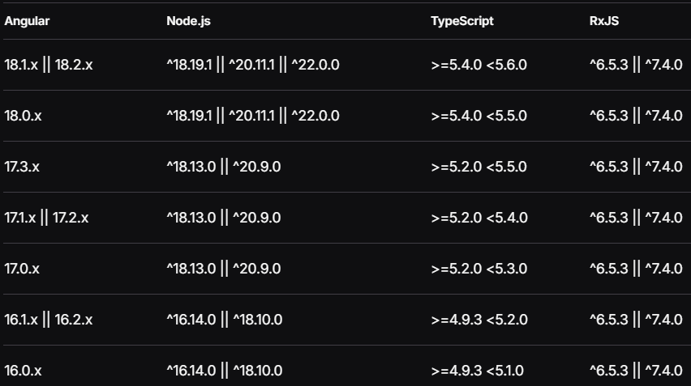
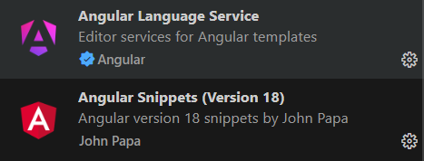
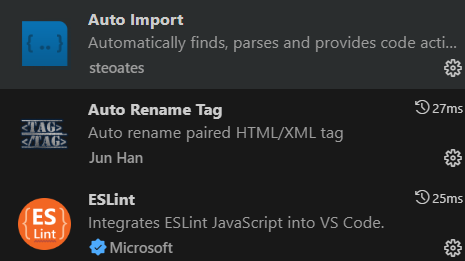
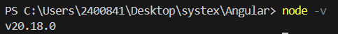
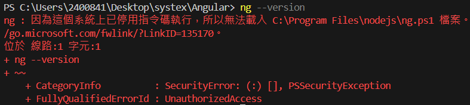
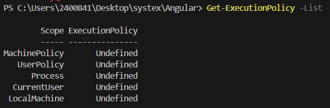
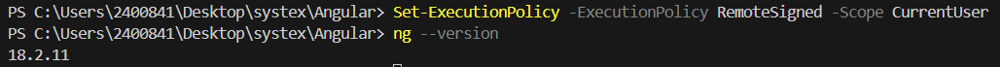
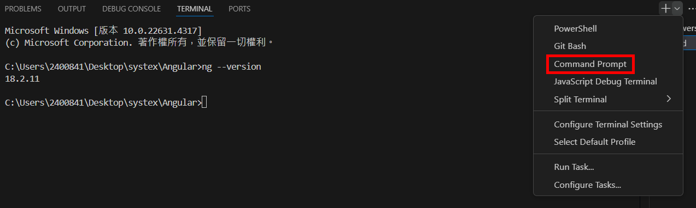
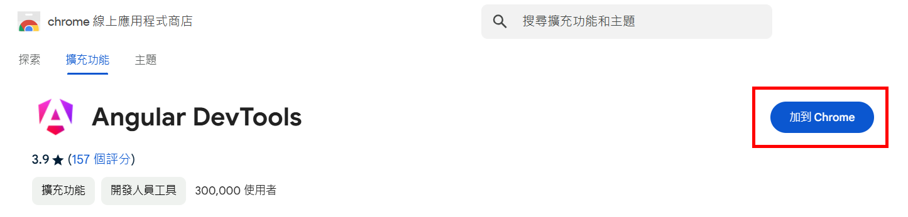

= 開發環境

Angular 各版本與其相應的 Node.js、TypeScript 和 RxJS 的版本兼容性要求，如下圖所示，可以根據所使用的版本配置對應的開發環境。

== VS code

本教材使用VS Code 進行 Angular 的教學。VS Code 是一款靈活且強大的編輯器，其輕量和高性能的特性結合了強大的擴展支持，適合 Angular 這樣的現代 Web 應用開發，內建 TypeScript 支持、自動補全、程式碼格式化等功能，使 Angular 開發更快速、更準確。

=== 套件推薦

- Angular Language Service 主要用於增強編輯器對 Angular 模板的智能提示和錯誤檢查，提供更高效的開發體驗。

- Angular Snippets (Version 18) 則提供預定義的代碼片段，幫助開發者快速創建 Angular 的基本代碼結構，節省時間，提高效率。

- Auto Import 幫助自動導入模塊和函數，減少手動導入的繁瑣操作。

- Auto Rename Tag 自動重命名 HTML/XML 標籤，保持配對標籤的一致性，防止結構錯誤。

- ESLint 提供代碼語法和風格檢查，幫助保持代碼質量並減少語法錯誤。

接下來創建一個新的資料夾，在VS Code中打開，並藉助其自帶終端就可以進行下一步Node.js和Angular cli的安裝了。

== Node.js

本教程使用的 Node 版本為20.18.0

== Angular Cli

透過 npm 來下載安裝最新版本Angular Cli，本教程使用的 Angular 版本為20.18.0

[source,cmd]
----
npm i -g @angular/cli
----

若要指定版本，可再後面加上@版本號

[source,cmd]
----
npm i -g @angular/cli@18.2.11
----

安裝完畢之後，就能使用ng指令。

=== TypeScript & RxJS

TypeScript 是 Angular 的核心語言，因為 Angular 是基於 TypeScript 開發的。當你使用 npm install -g @angular/cli 安裝 Angular CLI 時，Angular CLI 會安裝一個相應版本的 TypeScript，這樣可以確保所有的 Angular 應用都在兼容的 TypeScript 版本上進行開發。

RxJS 是 Angular 中非常重要的庫，用於處理響應式編程和異步數據流。Angular 中很多功能都依賴於 RxJS，例如 HttpClient、事件處理等。因此，Angular CLI 在安裝過程中也會自動引入相應版本的 RxJS。

=== PowerShell無法執行ng指令
VS Code 預設的終端是 PowerShell ，當執行ng指令時可能會看到一下畫面：

這是 PowerShell 為了提高系統的安全性而有的限制，防止惡意腳本運行。由於 PowerShell 擁有強大的系統訪問權限，這些限制策略可以防止意外或惡意的命令執行。對於開發者來說，可以根據需求設置一個合適的執行策略，例如 RemoteSigned，以便在保持一定安全性的同時能夠進行腳本開發。

透過 Get-ExecutionPolicy -List 指令查看，可以看到所有的執行策略 （ExecutionPolicy） 都是 Undefined。這意味著 PowerShell 中目前沒有設定具體的執行策略，這可能導致無法正常運行一些腳本或命令（例如 Angular CLI 的指令）。

==== 解決方案

- RemoteSigned

[source,cmd]
----
Set-ExecutionPolicy -Scope CurrentUser -ExecutionPolicy RemoteSigned
----

透過將執行策略設置為 RemoteSigned，這樣可以允許在本地創建的腳本執行

- 更換其他終端

== Angular DevTools

Angular DevTools 是專為 Angular 應用程序設計的瀏覽器開發者工具擴展，用於調試和分析應用的結構和性能。它可以幫助開發者在 Chrome 或 Edge 瀏覽器中檢查應用的組件樹、性能特性和依賴注入等細節，是一個非常實用的工具，特別是在構建和優化大型應用時。

可以通過瀏覽器的擴展商店（Chrome Web Store 或 Microsoft Edge Add-ons Store）搜索 Angular DevTools 並安裝。

link:課程介紹.adoc[課程介紹]
