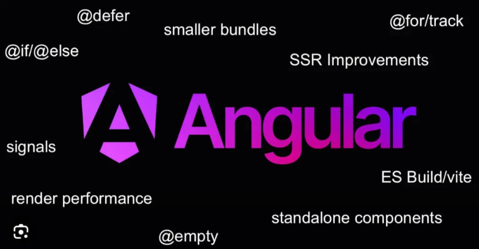

= 課程介紹 

在課程開始之前，我們先透過下表對Angular的不同版本的以及其對應新特性有初步的概念:

[cols="1,1,2", options="header"]
|===
| 版本 | 發布日期 | 新特性

| Angular 14
| 2022年6月2日
| 
- 強類型表單 (Typed Forms)
- 獨立元件 (Standalone Components)
- Angular CDK 中的新原語

| Angular 15
| 2022年11月18日
| 
-  獨立 API (Standalone APIs)
- 指令組合 API (Directive Composition API)

| Angular 16
| 2023年5月3日
| 
- 部分 Hydration 支持伺服器端渲染 (SSR)
- 實驗性的 Jest 測試支持
- 基於 Esbuild 的開發服務器構建系統

| Angular 17
| 2023年11月8日
| 
- 應用構建器 (Application Builder)
- 新控制流程語法
- 改版的學習和文檔網站

| Angular 18
| 2024年5月22日
| 
- 實驗性的無 Zone.js 變更檢測支持
- 伺服器端渲染性能改進
|===

不難發現，Angular 的發展趨勢集中在簡化開發流程、提高渲染性能、優化學習體驗以及提供更靈活的應用架構選擇。它逐步推動框架從複雜的模組依賴轉向輕量化和靈活性，並通過引入新的工具和技術來提升應用的性能，減少開發人員的工作量和學習曲線。這些改變反映出 Angular 希望能成為一個既適合大型應用也能靈活適應小型項目的前端框架。

== Angular版本的重要變化

對初學者而言，本教材的側重點在Angular 16到Angular 17的版本變化上，該次版本更新引進了新的語法和默認開發框架，由於這是較近期的改動，有許多專案仍然維持舊版本的程式碼風格，因此本教材將重點將放在Built-in Control Flow和standalone components上，盡可能透過兩個版本的對比，幫助初學者快速上手Angular。

link:前置作業.adoc[前置作業]